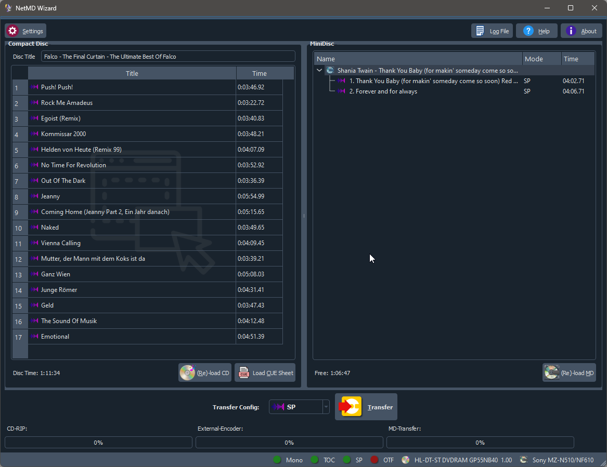
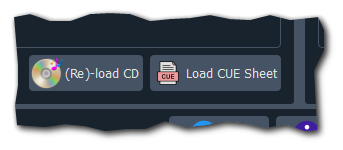
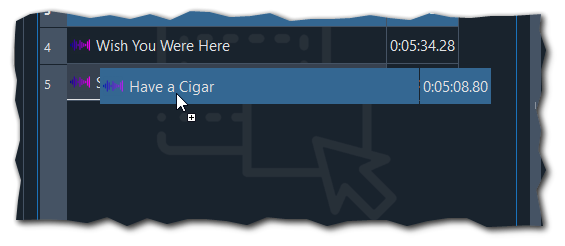
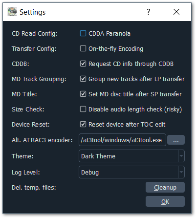

# NetMD Wizard #

NetMD Wizard is a program to write audio data to your NetMD device. 

## Features ##

- reads CD Audio through libcdio with optional CD Paranoia support
- reads CD-Text and requests CD information from CDDB (gnudb.org)
- support on-the-fly LP encoding on supporting devices
- gap-less audio transfer in LP mode (using external encoder)
- loads Cue Sheets and handles them as CD Audio
- drag and drop of audio files
- sorting and naming in the source widget
- naming, grouping in the MD tree widget
- supports Windows, Mac, and Linux

## Usage ##

> Note: Before using this tool under Windows you have to install the WebUSB library. This can be done using the [zadig tool](https://zadig.akeo.ie/).

Hopefully usage doesn't need much instruction. In a nutshell:

1. Import Audio Data
2. Load the Minidisc
3. Choose the audio quality
4. Press the button "Transfer".

### Import Audio Data ###

You have various possibilities to import audio data into the program:

- CD & Cue Sheet (through button 'Reload CD', 'Load CUE Sheet'):

- Drag and Drop Audio Files: 

In Cue Sheet as well through drag and drop following audio file types are supported:

| Audio File                                     | File Extension |
| ---------------------------------------------- | -------------- |
| WAVE (Raw PCM data with wave header)           | wav            |
| OGG Vorbis                                     | ogg            |
| Monkey Audio compressed WAVE files.            | ape            |
| Mpeg Audio Layer 3                             | mp3            |
| Advanced Audio Codec and Apple lossless (alac) | m4a, mp4       |
| Free Lossless Audio Codec                      | flac           |

You can use the audio import windows to remove unwanted tracks (delete key), sort tracks via drag and drop or rename the tracks: 

In Cue Sheet mode and when using a CD Audio, selected tracks will be transfered. If no track is selected, all tracks will be transfered. 

> Note: If you have inserted audio files through drag and drop all files will be transfered to MD. This is because I assume that you only drop wanted audio files to the program. 

### DAO Mode (Disc-at-Once) ###

In DAO modus the whole audio data will be extracted at once, encoded in one peace, cut in peaces and transfered to your NetMD device. This is so far the one possibility to get gap-less audio data on MD. This transfer type is supported not only when reading from CD. 

> Note: In DAO mode when reading from CD all sorting and deleting from tracks done in the source window will be reverted before the transfer starts.

## Settings ##

- __CD Read Config:__ You can enable CDDA paranoia mode here. In some cases this might give you better audio quality when reading from CD. This drastically slows down the CD read speed.
- __Transfer Config:__ In case your NetMD device support on-the-fly LP encoding this will be enabled by default. This gives better audio quality in LP mode then using the external encoder. Currently there are only 3 NetMD devices known which support on-the-fly encoding: Sony MDS-JB980, Sony MDS-JE780, Sharp IM-DR420H.
- __CDDB:__ Enable / disable the CDDB request for CD Audio information.
- __MD Track Grouping:__ If enabled a title group for a complete MD transfer is created (after LP transfer).
- __MD Title:__ If enabled the MD will be named after the disc from last SP audio transfer.
- __Theme:__ Use the theme you like most.
- __Log Level:__ Changes the detail grade of logging. 
- __Del. temp. files:__ Delete temporary files created be the program. Normally these files will be deleted before the progtram closes. In case of a program crash these files might persist in your temp folder. Pressing this button will delete these files.
- __Log File:__ Opens the log file. Useful for debugging or when I ask you for some more information. 

## Projects used / Thanks to ##
- [atracdenc](https://github.com/dcherednik/atracdenc) - the external ATRAC encoder
- [JSON for Modern C++](https://github.com/nlohmann/json)
- [Qt](https://qt.io) - One framework to rule them all.
- [webminidisc](https://github.com/cybercase/webminidisc) for inspiration
- [PLATINUM-MD](https://github.com/gavinbenda/platinum-md) for a good start with linux-minidisc
- [MSYS2](https://www.msys2.org/) for the Windows build environment of choice
- [libcue](https://github.com/Jo2003/libcue) for making Cue Sheet parsing a bit easier.
- [libcdio](https://www.gnu.org/software/libcdio/) for reading CDs on multi platform.
- [taglib](https://taglib.org/) for make reading tags much easier.
- [ffmpeg](https://www.ffmpeg.org/) to encode _xxx_ to compatible wav files. 

## Support ##

In case you find a bug (yes, there are some), please file a bug report on the project page: [GitHub](https://github.com/Jo2003/cd2netmd_gui).

## Support me ##
In case you find this tool useful, you may consider to [buy me a beer](https://paypal.me/Jo2003).

